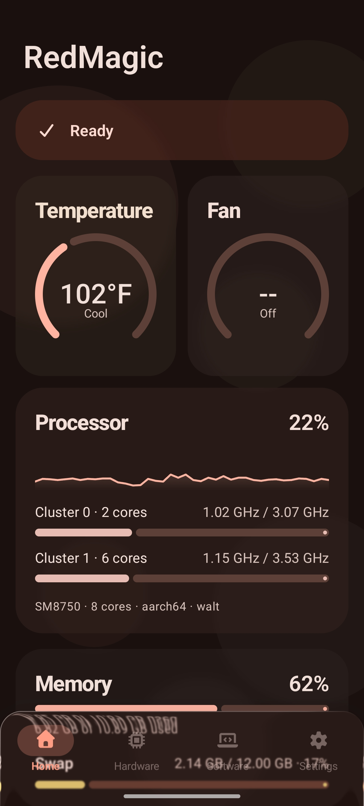
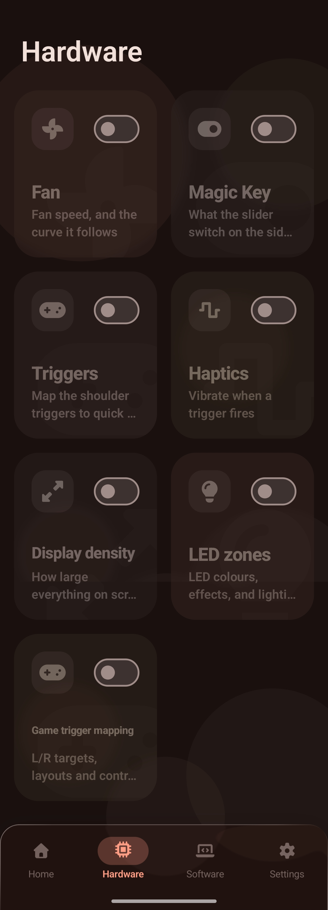
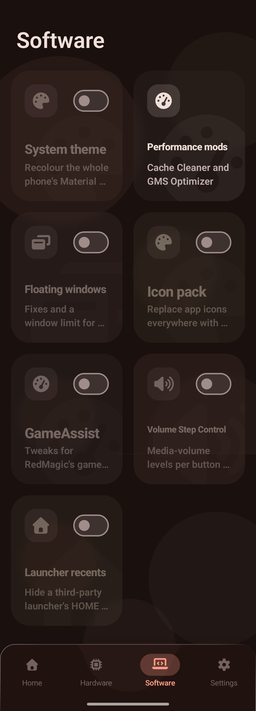
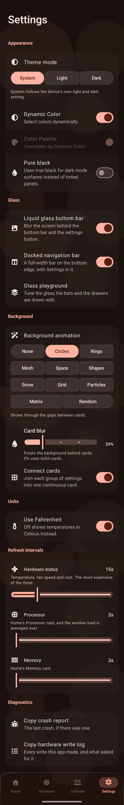

# 🚀 RedMagic Control Center

Root hardware and system control for the **RedMagic 10 Pro (NX789J)** running RedMagicOS.

---

## ⚠️ Before you start

Built and tested against **one** phone, the RedMagic 10 Pro. On anything else the app tells you
it's unsupported and holds the hardware tabs shut rather than guess.

Settings written to the system (disabled packages, display density, immersive state) outlive the
app — uninstalling doesn't undo them. Use the app's own switches to revert instead.

---

## 📱 What's in it

### Home
A live dashboard: status strip (phone model, root, Xposed module), temperature and fan dials,
processor load graph, memory.

## Home Preview



### Hardware
Each section has its own master switch and folds away when off.

| Section | What it does |
|---|---|
| **Fan** | Speed 0–5, preset curves, automatic temperature-following mode |
| **Magic Key** | Remaps the side slider to an app or shortcut |
| **Triggers** | Shoulder triggers mapped to quick actions, with intent-unlock |
| **Game trigger mapping** | Per-game L/R touch targets over the running game, with saved layouts |
| **Haptics** | Trigger feedback strength |
| **LED zones** | Fan ring and back logo colour/effect, live preview |
| **Game Mode** | A hardware profile applied automatically per-game |
| **Call lighting** | LED/fan behaviour for incoming and connected calls |
| **Charging mode** | Fan and LED behaviour while plugged in |
| **Display density** | Screen density override |

## Hardware Preview



### Software
Everything this app changes about *other* software.

**Needs the Xposed module** — floating window tweaks, global icon pack (with a root-only
mono-icon switch), GameAssist/GameSpace tweaks, Volume Step Control, Launcher recents.

**Needs only root** — System theme (recolours the whole phone's Material You palette, ported
from ColorBlendr), Performance mods (cache cleaner + GMS Optimizer), Block system updates.

## Software Preview



### Settings
Theme mode, Material You colour, pure black, docked vs. floating nav bar, a **Glass playground**
to tune the bottom bar's blur/tint/depth, card appearance (blur + connect toggle), background
animations, °C/°F, per-feature refresh intervals, and a diagnostics log.

## Settings Preview



---

## 🧩 The Xposed module

1. Install the app
2. Enable **Redmagic Control Center** in LSPosed, with the default scope
3. **Reboot** — hooks install once at boot and can't be added later

Home's status strip reports whether the module loaded *this* boot.

---

## 🔨 Building

```bash
./gradlew :app:assembleRelease
```

---

## 🙏 Credits

| Project | What came from it |
|---|---|
| [austineyoung2000/Redmagic-Control-Center](https://github.com/austineyoung2000/Redmagic-Control-Center) | The OG project that made this possible |
| [austineyoung2000/Redmagic-11-Toolbox](https://github.com/austineyoung2000/Redmagic-11-Toolbox) | Native Touch-Game-Key mapping, profile storage, vendor behavior |
| [Gio470/FixRedMagicWindow](https://github.com/Gio470/FixRedMagicWindow) | The floating-window hooks |
| [RichardLuo0/global-icon-pack-android](https://github.com/RichardLuo0/global-icon-pack-android) | The global icon pack |
| [RohitKushvaha01/TaskManager](https://github.com/RohitKushvaha01/TaskManager) | Processor and memory readings |
| [Mahmud0808/ColorBlendr](https://github.com/Mahmud0808/ColorBlendr) | System theme's recolouring |
| [khanhnguyen9872/NubiaToolkit](https://github.com/khanhnguyen9872/NubiaToolkit) | Hardware node reference |
| [Gio470/NPatch](https://github.com/Gio470/NPatch) · [MorpheApp/morphe-manager](https://github.com/MorpheApp/morphe-manager) · [alesimula/Murine-launcher](https://github.com/alesimula/Murine-launcher) | UI patterns |
| [Font Awesome Free](https://github.com/FortAwesome/Font-Awesome) | Every icon in the app |
